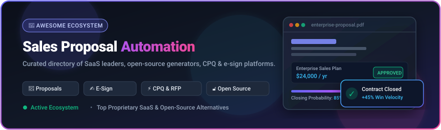

  

# 💼 Awesome Sales Proposal Automation

  
  
  
  
  
  
  

---

## 🌟 Overview & Ecosystem Guide

A curated list of leading **SaaS platforms**, **Configure-Price-Quote (CPQ)** systems, **RFP response management software**, and **open-source developer tools** for **Sales Proposal Automation**. 

These solutions empower modern B2B sales teams, MSPs, agencies, and consultants to generate branded interactive proposals, automate pricing calculations, track client document engagement in real-time, collect legally binding electronic signatures, and accelerate deal velocity.

> 📅 **Last updated:** September 2026

---

## 📑 Table of Contents

- [📊 Market Dynamics & Industry Overview](#-market-dynamics--industry-overview)
- [🏢 SaaS / Proprietary Platforms](#-saas--proprietary-platforms)
- [🔓 Open-Source GitHub Projects](#-open-source-github-projects)
- [🛠️ Architectural Patterns & Best Practices](#️-architectural-patterns--best-practices)
- [🤝 How to Contribute](#-how-to-contribute)
- [📈 Star History](#-star-history)
- [⚖️ Disclaimer](#️-disclaimer)

---

## 📊 Market Dynamics & Industry Overview

> 💡 **Market Size & Structure**: The global **Sales Proposal & Document Automation Software Market** is currently valued at approximately **$2.8 Billion – $4.8 Billion** and is projected to expand beyond **$9.5 Billion by 2032**, compounding at an annual growth rate (CAGR) of **~14.2%**. The sector is **moderately fragmented** rather than a winner-take-all monopoly, with distinct category leaders specializing in interactive web documents (PandaDoc, Qwilr), enterprise RFP automation (Responsive, Loopio), professional services billing engagements (Ignition), and digital sales rooms (GetAccept, ClientPoint).

---

## 🏢 SaaS / Proprietary Platforms

*Platforms are sorted below in descending order by estimated company size (valuation & ARR scale).*

| Platform | Focus & Key Capabilities | Company Size / Scale | Pricing (Starting Tier) | Free Tier / Free Trial Limits |
| :--- | :--- | :--- | :--- | :--- |
| 🐼 **[PandaDoc](https://www.pandadoc.com/)** | End-to-end document workflow platform covering proposals, quotes, contracts, e-signatures, payments, and analytics. | **~$1.0B Valuation** (Unicorn) • **~$100M+ ARR** • $101M+ Raised | Starts at **$19/user/month** (billed annually) or $35/user/month (monthly) for Starter plan | **Free forever plan** ("Free eSign") includes up to 60 document sends/year, 5 templates, and 2 recipients/doc. Also offers a **14-day free trial** of Business plan (up to 50 docs sent, no credit card required) |
| ⚡ **[Responsive](https://www.responsive.io/)** | Enterprise strategic response and proposal platform (formerly RFPIO) for automated RFP, RFI, and security questionnaire completion. | **~$400M–$500M Est. Valuation** • **~$95M ARR** • $100M+ Raised | Starts at **~$583/month** ($7,000/year annual contract) or ~$499/user/month for Lite tier (enterprise sales quote) | **No permanent free plan**; **0-day self-serve trial** (evaluation offered via personalized 1-on-1 sales demo and guided sandbox access upon request) |
| 💼 **[Ignition](https://www.ignitionapp.com/)** | Proposal, engagement-letter, and automated payment/billing platform purpose-built for accounting, legal, and professional services firms. | **~$330M Est. Valuation** • **~$48M–$50M ARR** • $75M+ Raised | Starts at **$39/month** (billed annually) or $49/month (monthly) for Solo plan (up to 20 active clients) | **14-day free trial** (no credit card required) with complete feature access and up to $10,000 in payment processing with 0% platform fees; no permanent free plan |
| 🔄 **[Loopio](https://loopio.com/)** | Intelligent response management platform with automated content libraries for complex proposals, bids, DDQs, and RFPs. | **~$150M–$200M Est. Valuation** • **~$34M–$35M ARR** • $209M Raised | Starts at **~$833/month** ($10,000/year annual contract) or ~$120/user/month for Foundations tier (enterprise sales quote) | **No permanent free plan**; **0-day self-serve trial** (evaluation provided through custom live sales demo walkthrough and workflow evaluation upon request) |
| 🤝 **[GetAccept](https://www.getaccept.com/)** | Digital Sales Room (DSR) and proposal platform combining interactive deal rooms, video recording, live buyer chat, and e-signatures. | **~$80M–$100M Est. Valuation** • **~$18M–$30M ARR** • $30M+ Raised | Starts at **$25/user/month** (billed annually) for Essential/eSign tier (Professional starts at $49/user/month with 5-seat minimum) | **14-day free trial** (no credit card required) with access to proposal tracking, video recording, deal rooms, and e-signatures; no permanent free plan |
| 🌐 **[ClientPoint](https://www.clientpoint.net/)** | Enterprise relationship enablement and proposal software featuring interactive digital workspaces, content libraries, and deal tracking. | **~$45M Est. Valuation** • **~$6.3M ARR** • $5M Raised | Starts at **$42/month** (Small Business) or $83/month (Sales Accelerator tier) | **Free forever plan** (ClientPoint.me) with unlimited e-signatures, file sharing, video meetings, and basic proposal rooms; 14-day trial available on request for enterprise tiers |
| 📄 **[Qwilr](https://qwilr.com/)** | Modern web-based proposal platform known for interactive web-page proposals, responsive design control, and granular view analytics. | **~$30M–$40M Est. Valuation** • **~$7M–$18M ARR** • $8.9M Raised | Starts at **$35/user/month** (billed annually at $420/yr) or $49/user/month (monthly) for Starter plan | **14-day free trial** (no credit card required) with full Starter features (e-signatures, analytics, QwilrPay; pages stay live 30 days post-trial); no permanent free plan |
| 📝 **[Proposify](https://www.proposify.com/)** | Dedicated proposal software focused on reusable snippet libraries, brand consistency control, engagement analytics, and pipeline visibility. | **~$25M–$30M Est. Valuation** • **~$8M–$10M ARR** • $13M Raised | Starts at **$19/user/month** (billed annually) or $29/user/month (monthly) for Basic plan (up to 2 users) | **14-day free trial** (no credit card required) with full Team plan features and up to 10 document sends; no permanent free plan |
| 🚀 **[Better Proposals](https://betterproposals.io/)** | Streamlined, template-driven proposal tool designed for freelancers, agencies, and small businesses to send high-converting documents quickly. | **~$5M–$8M Est. Valuation** • **~$1M–$2M ARR** • Bootstrapped | Starts at **$13/user/month** (billed annually) or $19/user/month (monthly) for Starter plan (includes 10 docs/mo) | **14-day free trial** (no credit card required) with full access to Premium plan features and 50 document allowance; no permanent free plan |
| ✍️ **[Nusii](https://www.nusii.com/)** | Minimalist, elegant proposal and quote software favored by creative agencies, freelancers, and independent consultancies. | **~$1M–$3M Est. Valuation** • **<$1M ARR** • Bootstrapped | Starts at **$29/month** for Freelancer plan (1 user, up to 5 active proposals) or $49/month for Agency (3 users, 20 active proposals) | **14-day free trial** (full access to proposal generator and activity tracking; requires card at signup; 60-day money-back guarantee); no permanent free plan |

---

## 🔓 Open-Source GitHub Projects

*Repositories are sorted below in descending order by GitHub star count.*

- 📜 **[Documenso](https://github.com/documenso/documenso)**   
  The community-driven, open-source DocuSign alternative. Provides document signing workflows, public signable templates, verification cryptographic hashing, and developer webhooks.

- 💰 **[Invoice Ninja](https://github.com/invoiceninja/invoiceninja)**   
  Comprehensive open-source client management, invoicing, project quoting, and proposal tracking application built with Laravel and Flutter.

- 🖨️ **[WeasyPrint](https://github.com/Kozea/WeasyPrint)**   
  Visual document and proposal rendering engine turning semantic HTML5/CSS3 templates into print-ready, high-fidelity PDF sales proposals, quotes, and reports.

- ✍️ **[OpenSign](https://github.com/OpenSignLabs/OpenSign)**   
  Free, open-source electronic signature platform with PDF document signing, form field annotations, audit trails, and REST API integration.

- 📐 **[pdfme](https://github.com/pdfme/pdfme)**   
  Open-source TypeScript/React PDF generation library and visual WYSIWYG template designer for assembling dynamic business proposals, quotes, and certificates in the browser and Node.js.

- 📄 **[Carbone](https://github.com/carboneio/carbone)**   
  Lightning-fast JSON-to-PDF/DOCX/ODT template engine for generating branded sales proposals, quotes, and legal contracts directly from application data.

- 📑 **[docx-templates](https://github.com/guigrpa/docx-templates)**   
  Template-based Word (`.docx`) document generation library supporting dynamic data binding, loops, nested tables, and inline JavaScript logic for proposals and quotes.

- ⚡ **[SwiftCPQ](https://github.com/christopher-talke/SwiftCPQ)**   
  Vendor-agnostic, open-source Configure-Price-Quote (CPQ) and sales proposal tool designed as an accessible self-hosted alternative to ConnectWise CPQ and Kaseya Quote Manager for MSPs and IT consultancies.

- 🪄 **[Proppy](https://github.com/WeAreWizards/proppy)**   
  Open-source proposal creation system for drafting and delivering interactive, modern sales proposals on the web.

- 🤖 **[Agentic Proposal Generator](https://github.com/griv32/agentic-proposal-generator)**   
  Multi-agent AI pipeline built with the Claude Agent SDK that converts B2B discovery call transcripts into structured, customized business proposals.

- 🔨 **[ProposalForge](https://github.com/ICodingStack/ProposalForge)**   
  Free, open-source, client-side proposal and quote builder featuring interactive pricing tables, AI-assisted drafting, real-time live preview, and instant PDF export (runs 100% offline in browser).

- 🎯 **[BidCraft](https://github.com/bhargavhari2001-cloud/BidCraft)**   
  Open-source AI-powered RFP automation platform utilizing Retrieval-Augmented Generation (RAG) to extract requirements from RFP documents and generate tailored draft bids.

---

## 🛠️ Architectural Patterns & Best Practices

When building internal sales proposal pipelines or hybrid commercial/open stacks, consider the following best practices:

1. **Modular Content Repositories**: Store proposal snippets, case studies, and legal disclosures in version-controlled markdown or structured JSON/DOCX blocks.
2. **Dynamic Pricing Tables (CPQ)**: Separate pricing logic and tax/discount calculations from document formatting to prevent quoting errors.
3. **Auditability & E-Sign Compliance**: Ensure generated proposal documents include immutable audit logs, tamper-evident cryptographic hashes, and compliant electronic signature flows.
4. **Buyer Engagement Telemetry**: Embed tracking pixels or use digital sales room links to measure time-per-page, section dwell time, and forwarded recipient visibility.

---

## 🤝 How to Contribute

Contributions are warmly welcomed! To suggest a new tool or update an existing entry:

1. 🍴 Fork the repository.
2. 🌿 Create a feature branch (`git checkout -b add-tool-name`).
3. 📝 Add your entry under the corresponding section following the established format (include official links, pricing, free tier limits, or star badges).
4. 🚀 Open a Pull Request with a short explanation of the contribution.

---

## 📈 Star History

---

## ⚖️ Disclaimer

- This directory is **community-curated** for informational purposes and does not constitute a formal commercial endorsement.
- Sales proposals frequently contain sensitive pricing, terms of service, and legally binding commitments. Always verify generated documents and ensure compliance with regional e-signature regulations (e.g., ESIGN, eIDAS).

---

  <b>Built for modern sales organizations, MSPs, agencies, and revenue teams closing deals faster.</b>

